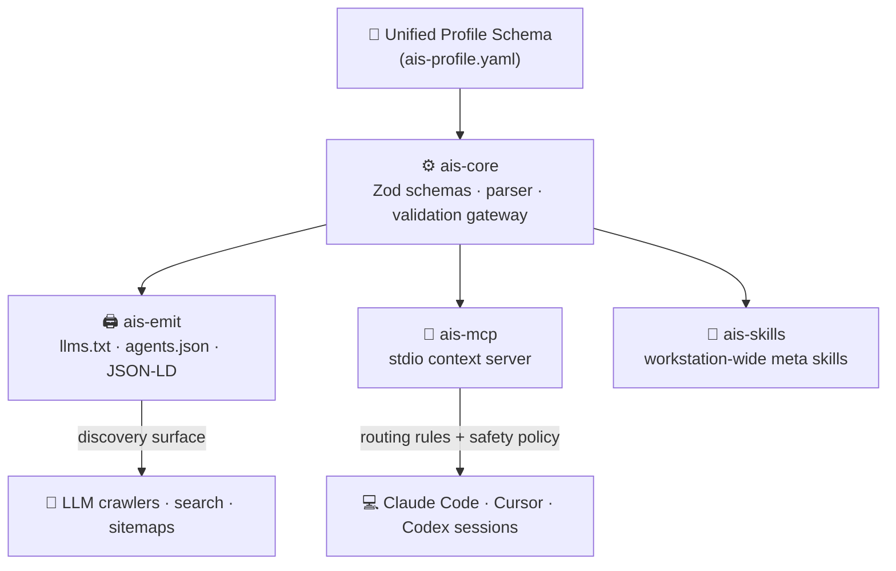
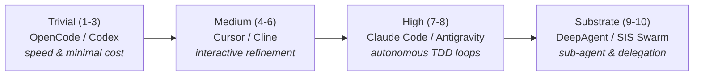

<div align="center">

# 🏛️ Agentic Intelligence System (AIS)

### The discovery, routing & capabilities orchestrator for AI coding agents

> When any AI agent in the world — crawlers, search engines, or active terminal
> processes — requests information in your domain, AIS ensures it **discovers,
> cites, and correctly routes** workflows to your codebase. The AEO/GEO substrate
> and multi-agent coordination layer.

[](LICENSE)
[](https://www.typescriptlang.org/)
[](https://pnpm.io/)
[](https://modelcontextprotocol.io/)
[](https://github.com/frankxai/Starlight-Intelligence-System)

[**📦 Packages**](#-monorepo-packages) · [**⚡ Routing protocol**](#-the-active-workstation-fleet--routing-protocol) · [**🛠️ Getting started**](#️-getting-started)

</div>

---

> [!NOTE]
> Sibling to [Starlight Intelligence System (SIS)](https://github.com/frankxai/Starlight-Intelligence-System),
> [Library OS](https://github.com/frankxai/library-os), and
> [Second Brain OS](https://github.com/frankxai/second-brain-os). AIS is the
> *discoverability* substrate: it makes your workspace legible and routable to every agent
> that touches it.

---

## 🗺️ Architectural ecosystem

A single unified profile (`ais-profile.yaml`) drives three decoupled emitters and the live MCP server.



---

## 📦 Monorepo packages

Four decoupled, compile-safe packages under one `pnpm` workspace:

### 1. ⚙️ [`@frankx-ai/ais-core`](packages/core/README.md)
* **Purpose:** The parser and validation gateway.
* **Stack:** Zod schemas, TypeScript.
* **Responsibility:** Parses the unified [`ais-profile.yaml`](ais-profile.yaml), ensuring agent specs, skill parameters, repository boundaries, and hardware capacity constraints comply with types.

### 2. 🖨️ [`@frankx-ai/ais-emit`](packages/emit/README.md)
* **Purpose:** Build-time SEO & discovery generators.
* **Responsibility:** Compiles structural documentation:
  * [`llms.txt`](llms.txt) — discovery format for LLM search bots.
  * [`agents.json`](agents.json) — machine-readable workspace capabilities inventory.
  * [`JSON-LD`](jsonld.json) — Schema.org structured metadata for website sitemaps.

### 3. 🔌 [`@frankx-ai/ais-mcp`](packages/mcp/README.md)
* **Purpose:** Live context exchange server.
* **Stack:** Model Context Protocol (MCP) Node.js SDK.
* **Responsibility:** Starts an MCP server on `stdio` to feed agent routing rules, workstation capacity constraints, and repository safety policies directly into developer terminal sessions.

### 4. 🧠 [`@frankx-ai/ais-skills`](packages/skills/README.md)
* **Purpose:** Workstation-wide meta agent skills.
* **Responsibility:** Houses global workspace skills (e.g. `agent-manager-skill`, `model-routing`) and distributes them dynamically to local directories (`~/.agents/skills/` and `~/.claude/skills/`).

---

## ⚡ The active workstation fleet & routing protocol

AIS establishes a first-principles task-mapping system based on requirement complexity:



| Complexity Tier | Target Agent | Primary LLM | Recommended Task Types |
| :--- | :--- | :--- | :--- |
| **1-3** | **OpenCode** / **Codex** | `groq/llama-4-scout` / `gpt-4o` | Single-file script edits, config modernizations, formatting, doc updates. |
| **4-6** | **Cursor** / **Cline** | Pluggable | Interactive layouts, CSS styling, component refactoring, UI adjustments. |
| **7-8** | **Claude Code** / **Antigravity** | `claude-3-5-sonnet` / `gemini-1.5-pro` | Multi-file refactors, test-driven iterations, large-context digestion. |
| **9-10** | **DeepAgent** / **SIS Swarm** | Custom / Pluggable | Long-horizon multi-step planning, remote sandbox runs, agent swarms. |

---

## 🛠️ Getting started

### Prerequisites
* Node.js >= 24
* pnpm 9.x

### Installation

```bash
git clone https://github.com/frankxai/agentic-intelligence-system.git
cd agentic-intelligence-system
pnpm install
```

### Build & test

```bash
pnpm build       # build all TS packages
pnpm test        # run unit tests across packages
pnpm typecheck   # tsc --noEmit across the workspace
```

### Run the MCP server locally

Add the server to your Claude Code / desktop config (`mcp.json`), pointing at your local checkout:

```json
{
  "mcpServers": {
    "agent-intelligence-system": {
      "command": "node",
      "args": ["/abs/path/to/agentic-intelligence-system/packages/mcp/dist/index.js"],
      "env": {
        "AIS_PROFILE_PATH": "/abs/path/to/agentic-intelligence-system/ais-profile.yaml"
      }
    }
  }
}
```

---

<div align="center">

**Built on SIP** · Starlight Intelligence Protocol · MIT — see [LICENSE](LICENSE)

</div>
