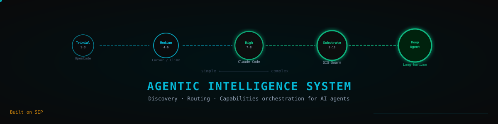
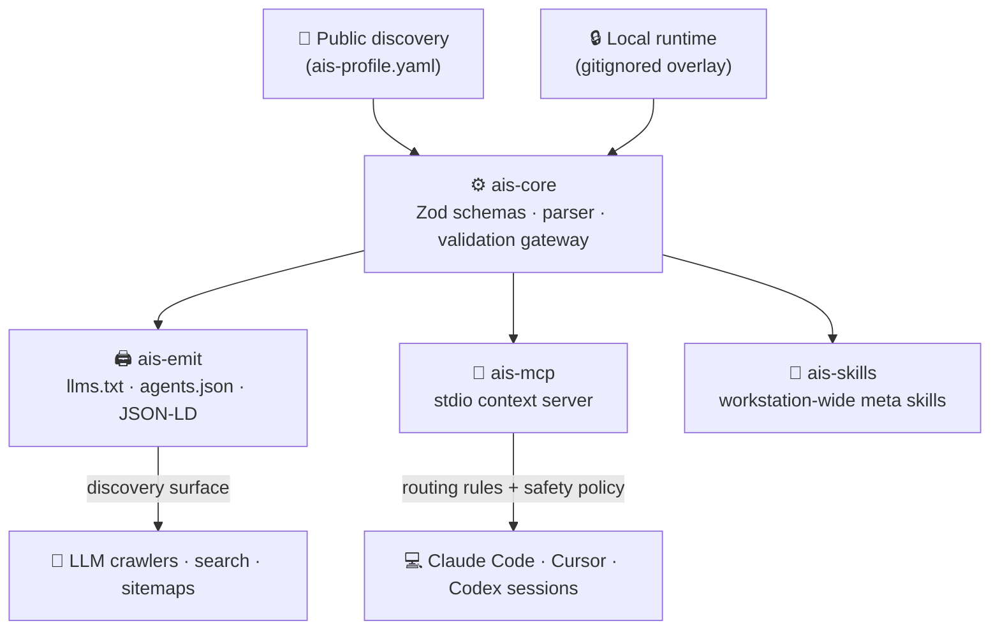

<p align="center">
  
</p>

<div align="center">

# 🏛️ Agentic Intelligence System (AIS)

### The discovery, routing & capabilities orchestrator for AI coding agents

> When any AI agent in the world — crawlers, search engines, or active terminal
> processes — requests information in your domain, AIS ensures it **discovers,
> cites, and correctly routes** workflows to your codebase. The AEO/GEO substrate
> and multi-agent coordination layer.

[](LICENSE)
[](https://www.typescriptlang.org/)
[](https://pnpm.io/)
[](https://modelcontextprotocol.io/)
[](https://github.com/frankxai/Starlight-Intelligence-System)

[**📦 Packages**](#packages) · [**⚡ Routing protocol**](#routing-protocol) · [**🛠️ Getting started**](#getting-started)

</div>

---

> [!NOTE]
> Sibling to [Starlight Intelligence System (SIS)](https://github.com/frankxai/Starlight-Intelligence-System),
> [Library OS](https://github.com/frankxai/library-os), and
> [Second Brain OS](https://github.com/frankxai/second-brain-os). AIS is the
> *discoverability* substrate: it makes your workspace legible and routable to every agent
> that touches it.

---

## 🗺️ Architectural ecosystem

`ais-profile.yaml` is public by design and contains only the allowlisted discovery projection. Workstation, provider, model, cost, command, failure-mode, and repository-policy data belong in the gitignored `ais-runtime.local.yaml` (or another local path supplied through `AIS_PROFILE_PATH`).



---

<a id="packages"></a>

## 📦 Monorepo packages

Four decoupled, compile-safe packages under one `pnpm` workspace:

### 1. ⚙️ [`@frankx-ai/ais-core`](packages/core/README.md)
* **Purpose:** The parser and validation gateway.
* **Stack:** Zod schemas, TypeScript.
* **Responsibility:** Validates the public discovery profile and the local runtime profile through separate, strict schemas.

### 2. 🖨️ [`@frankx-ai/ais-emit`](packages/emit/README.md)
* **Purpose:** Build-time SEO & discovery generators.
* **Responsibility:** Compiles only the explicit `publicDiscovery` allowlist; local machine, model, cost, command, failure-mode, and harness fields are excluded by construction:
  * [`llms.txt`](llms.txt) — discovery format for LLM search bots.
  * [`agents.json`](agents.json) — machine-readable workspace capabilities inventory.
  * [`JSON-LD`](jsonld.json) — Schema.org structured metadata for website sitemaps.

### 3. 🔌 [`@frankx-ai/ais-mcp`](packages/mcp/README.md)
* **Purpose:** Live context exchange server.
* **Stack:** Model Context Protocol (MCP) Node.js SDK.
* **Responsibility:** Starts an MCP server on `stdio` to feed agent routing rules, workstation capacity constraints, and repository safety policies directly into developer terminal sessions.

### 4. 🧠 [`@frankx-ai/ais-skills`](packages/skills/README.md)
* **Purpose:** Workstation-wide meta agent skills.
* **Responsibility:** Houses global workspace skills (e.g. `agent-manager-skill`, `model-routing`) and distributes them dynamically to local directories (`~/.agents/skills/` and `~/.claude/skills/`).

---

<a id="routing-protocol"></a>

## ⚡ Capability routing

Public discovery describes stable, provider-agnostic capabilities. The MCP server selects among the agents configured in the local runtime profile; provider names, models, costs, machine capacity, aliases, and repository policies are never required in the public repository.

---

<a id="getting-started"></a>

## 🛠️ Getting started

### Prerequisites
* Node.js >= 24
* pnpm 9.x

### Installation

```bash
git clone https://github.com/frankxai/agentic-intelligence-system.git
cd agentic-intelligence-system
pnpm install
```

### Build & test

```bash
pnpm build       # build all TS packages
pnpm test        # run unit tests across packages
pnpm typecheck   # tsc --noEmit across the workspace
```

### Run the MCP server locally

Create a gitignored `ais-runtime.local.yaml` that satisfies `RuntimeProfileSchema`, then point the server at that local file from your desktop configuration:

```json
{
  "mcpServers": {
    "agent-intelligence-system": {
      "command": "node",
      "args": ["/abs/path/to/agentic-intelligence-system/packages/mcp/dist/index.js"],
      "env": {
        "AIS_PROFILE_PATH": "/abs/path/to/agentic-intelligence-system/ais-runtime.local.yaml"
      }
    }
  }
}
```

---

<div align="center">

**Built on SIP** · Starlight Intelligence Protocol · MIT — see [LICENSE](LICENSE)

</div>
