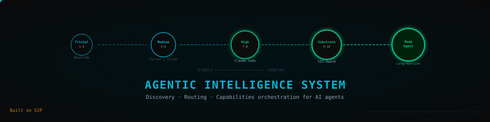
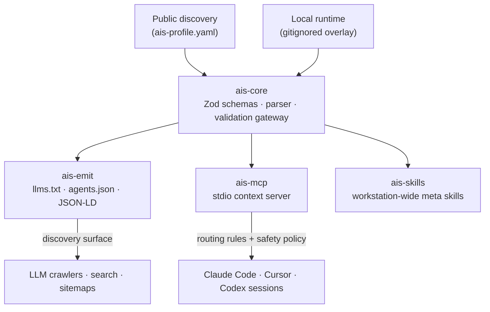

<p align="center">
  
</p>

<div align="center">

# Agentic Intelligence System (AIS)

### The discovery, routing & capabilities orchestrator for AI coding agents

> AIS publishes `llms.txt`, `agents.json`, and JSON-LD that describe your workspace
> to crawlers and search engines, and runs a local MCP server that gives coding
> agents routing rules and repository safety policies.

[](LICENSE)
[](https://www.typescriptlang.org/)
[](https://pnpm.io/)
[](https://modelcontextprotocol.io/)
[](https://github.com/frankxai/Starlight-Intelligence-System)

[**Packages**](#packages) · [**Routing protocol**](#routing-protocol) · [**Getting started**](#getting-started)

</div>

---

> [!NOTE]
> Sibling to [Starlight Intelligence System (SIS)](https://github.com/frankxai/Starlight-Intelligence-System),
> [Library OS](https://github.com/frankxai/library-os), and
> [Second Brain OS](https://github.com/frankxai/second-brain-os). AIS is the
> *discoverability* substrate: it makes your workspace legible and routable to every agent
> that touches it.

---

## Architectural ecosystem

`ais-profile.yaml` is public by design and contains only the allowlisted discovery projection. Workstation, provider, model, cost, command, failure-mode, and repository-policy data belong in the gitignored `ais-runtime.local.yaml` (or another local path supplied through `AIS_PROFILE_PATH`).


```mermaid
flowchart TB
    Profile["Public discovery<br/>(ais-profile.yaml)"]
    Runtime["Local runtime<br/>(gitignored overlay)"]
    Core["ais-core<br/>Zod schemas · parser · validation gateway"]
    Emit["ais-emit<br/>llms.txt · agents.json · JSON-LD"]
    MCP["ais-mcp<br/>stdio context server"]
    Skills["ais-skills<br/>workstation-wide meta skills"]

    Profile --> Core
    Core --> Emit
    Runtime --> Core
    Core --> MCP
    Core --> Skills
    Emit -->|discovery surface| Bots["LLM crawlers · search · sitemaps"]
    MCP -->|routing rules + safety policy| Terminal["Claude Code · Cursor · Codex sessions"]
```

---

<a id="packages"></a>

## Monorepo packages

Four decoupled, compile-safe packages under one `pnpm` workspace:

### 1. [`@frankx-ai/ais-core`](packages/core/README.md)
* **Purpose:** The parser and validation gateway.
* **Stack:** Zod schemas, TypeScript.
* **Responsibility:** Validates the public discovery profile and the local runtime profile through separate, strict schemas.

### 2. [`@frankx-ai/ais-emit`](packages/emit/README.md)
* **Purpose:** Build-time SEO & discovery generators.
* **Responsibility:** Compiles only the explicit `publicDiscovery` allowlist; local machine, model, cost, command, failure-mode, and harness fields are excluded by construction:
  * [`llms.txt`](llms.txt) — discovery format for LLM search bots.
  * [`agents.json`](agents.json) — machine-readable workspace capabilities inventory.
  * [`JSON-LD`](jsonld.json) — Schema.org structured metadata for website sitemaps.

### 3. [`@frankx-ai/ais-mcp`](packages/mcp/README.md)
* **Purpose:** Live context exchange server.
* **Stack:** Model Context Protocol (MCP) Node.js SDK.
* **Responsibility:** Starts an MCP server on `stdio` to feed agent routing rules, workstation capacity constraints, and repository safety policies directly into developer terminal sessions.

### 4. [`@frankx-ai/ais-skills`](packages/skills/README.md)
* **Purpose:** Workstation-wide meta agent skills.
* **Responsibility:** Houses global workspace skills (e.g. `agent-manager-skill`, `model-routing`) and distributes them dynamically to local directories (`~/.agents/skills/` and `~/.claude/skills/`).

---

<a id="routing-protocol"></a>

## Capability routing

Public discovery describes stable, provider-agnostic capabilities. The MCP server selects among the agents configured in the local runtime profile; provider names, models, costs, machine capacity, aliases, and repository policies are never required in the public repository.

### What AIS is not

AIS is the **discovery, AEO/GEO, capability-routing and workspace-legibility** layer. It is not a memory
system and not an orchestration UI. It answers three questions — *what can this repository do*, *which
capability does this request route to*, *what is the citation* — and hands execution back to whatever
runtime the caller already has. Repository and team identity are owned by the **AI Capability Registry**
(`starlight.repo_profile.v2` / `starlight.team_profile.v2`); AIS binds to those contracts by reference.

### AIS.v1 — the routing contract

`lib/ais/` is dependency-free ESM. It runs on plain Node with **no install**, because a discovery layer
that needs a build step is not the first thing an agent can reach for.

Nine node types: **RepositoryProfile, TeamProfile, Capability, Route, Policy, Evidence, Citation,
AgentRequest, Resolution.** Every node carries `owner`, `provenance`, `version`, `visibility` and an
`evaluation` rule — the sentence that would falsify it.

```bash
node bin/ais.mjs scan .                                   # sanitized RepositoryProfile + capabilities
node bin/ais.mjs route . --intent "run the tests"          # → Resolution + Citation + receipt
node bin/ais.mjs drift . --registry ../ai-capability-registry
node --test "tests/*.test.mjs"                             # 16 tests, no install required
```

Four rules do the work:

| Rule | Effect |
| --- | --- |
| Denylist before read | `.env*`, keys, wallets, `credentials.*`, every dot-directory — counted, never opened. One redaction pass scrubs tokens, JWTs, emails and operator home paths from whatever survives. |
| `E_UNEVIDENCED_CAPABILITY` | An `active` capability must point at Evidence with a `repo:` or `https:` locator. Otherwise it is `watch`. |
| `E_RESOLVED_WITHOUT_CITATION` | A resolution may only be `resolved` if it carries a citation. No route, or no evidence, means *refused* or *ambiguous* — never a guess. |
| Drift `unavailable` ≠ pass | With no registry path supplied, the drift check reports `unavailable` and says so. Absence is never reported as agreement. |

**Activation event:** a receipt under `.ais/receipts/` whose resolution is `resolved` with at least one
citation whose locator still resolves. `isActivation()` is the single place that rule lives.

Absolute machine paths are refused as source references by the schema itself, so a profile cannot carry
the operator's filesystem into a public artifact even by accident.

---

<a id="getting-started"></a>

## Getting started

### Prerequisites
* Node.js >= 24
* pnpm 9.x

### Installation

```bash
git clone https://github.com/frankxai/agentic-intelligence-system.git
cd agentic-intelligence-system
pnpm install
```

### Build & test

```bash
pnpm build       # build all TS packages
pnpm test        # run unit tests across packages (vitest, needs install)
pnpm typecheck   # tsc --noEmit across the workspace
pnpm test:ais    # AIS.v1 suite — plain node, no install needed
```

### Run the MCP server locally

Create a gitignored `ais-runtime.local.yaml` that satisfies `RuntimeProfileSchema`, then point the server at that local file from your desktop configuration:

```json
{
  "mcpServers": {
    "agent-intelligence-system": {
      "command": "node",
      "args": ["/abs/path/to/agentic-intelligence-system/packages/mcp/dist/index.js"],
      "env": {
        "AIS_PROFILE_PATH": "/abs/path/to/agentic-intelligence-system/ais-runtime.local.yaml"
      }
    }
  }
}
```

---

<div align="center">

**Built on SIP** · Starlight Intelligence Protocol · MIT — see [LICENSE](LICENSE)

</div>
